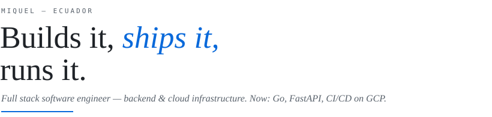
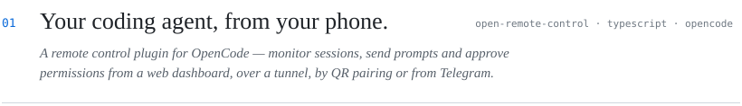
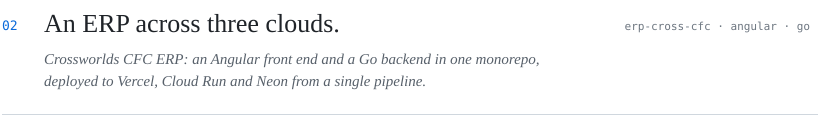
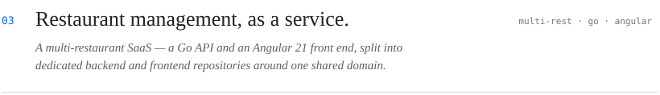
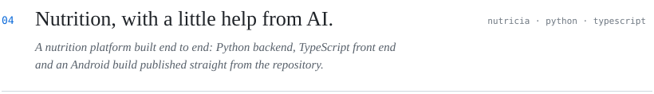
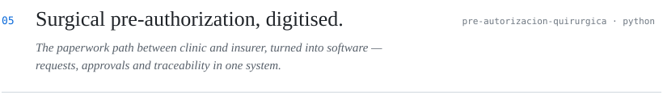
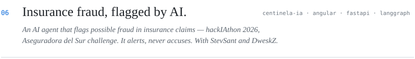
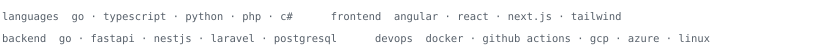
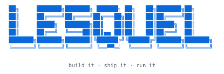

<picture>
  <source media="(prefers-color-scheme: dark)" srcset="./assets/header-dark.svg">
  
</picture>

 

SELECTED WORKS

<a href="https://github.com/lesquel/open-remote-control">
  <picture>
    <source media="(prefers-color-scheme: dark)" srcset="./assets/works-01-dark.svg">
    
  </picture>
</a>

<a href="https://github.com/lesquel/ERPCrossCFC">
  <picture>
    <source media="(prefers-color-scheme: dark)" srcset="./assets/works-02-dark.svg">
    
  </picture>
</a>

<a href="https://github.com/lesquel/multi-rest">
  <picture>
    <source media="(prefers-color-scheme: dark)" srcset="./assets/works-03-dark.svg">
    
  </picture>
</a>

<a href="https://github.com/lesquel/NutricIA">
  <picture>
    <source media="(prefers-color-scheme: dark)" srcset="./assets/works-04-dark.svg">
    
  </picture>
</a>

<a href="https://github.com/lesquel/pre-autorizacion-quirurgica">
  <picture>
    <source media="(prefers-color-scheme: dark)" srcset="./assets/works-05-dark.svg">
    
  </picture>
</a>

IN COLLABORATION

<a href="https://github.com/StevSant/hackiaton_agent_ai_3.0_frontend">
  <picture>
    <source media="(prefers-color-scheme: dark)" srcset="./assets/works-06-dark.svg">
    
  </picture>
</a>

<a href="https://github.com/lesquel?tab=repositories">all repositories →</a>

STACK

<picture>
  <source media="(prefers-color-scheme: dark)" srcset="./assets/stack-dark.svg">
  
</picture>

ACTIVITY

<picture>
  <source media="(prefers-color-scheme: dark)" srcset="https://github-readme-activity-graph.vercel.app/graph?username=lesquel&bg_color=0d1117&color=8b949e&line=58a6ff&point=58a6ff&area=true&area_color=58a6ff&hide_border=true&hide_title=true">
  
</picture>

ELSEWHERE

<a href="https://www.linkedin.com/in/soquel1319/">linkedin</a> · <a href="mailto:lesquel1319@gmail.com">lesquel1319@gmail.com</a>

 

  

  <i>The author, waiting on CI.</i>

  <picture>
    <source media="(prefers-color-scheme: dark)" srcset="./assets/colophon-dark.svg">
    
  </picture>

